# Satellite Image Land-Use Classifier & Temporal Change Detector

<div align="center">


A full end-to-end deep learning pipeline for **satellite image land-use classification** and **temporal change detection**, built with PyTorch and ResNet-18 transfer learning on the EuroSAT dataset.

[📌 Project Overview](#-project-overview) • [🔬 Features](#-features) • [🚀 Installation](#-installation) • [📊 Results](#-results-summary) • [🎬 Demo](#-demo-video)

</div>

---

## 📌 Project Overview

This project implements a production-grade computer vision system that addresses two core remote-sensing tasks:

1. **Land-Use Classification** — Classify satellite image patches into 10 semantic land-use categories (e.g. Forest, Residential, Highway) using a fine-tuned ResNet-18 backbone.
2. **Temporal Change Detection** — Compare embedding-space representations of the same geographic tile at two different time points using cosine similarity, flagging land-cover changes above a Youden-optimised threshold.

The system also includes a rigorous **Spatial Leakage Experiment** to quantify how much conventional random-split evaluation over-estimates real-world generalisation, and an interactive **Streamlit Geo-Dashboard** for live inference on any uploaded image pair.

> **Dataset:** EuroSAT (27,000 Sentinel-2 RGB patches, 10 classes) · **Holdout:** UC Merced Land Use (2,100 aerial images, 21 classes)

---

## 🔬 Features

| Module | Capability |
|--------|-----------|
| 🧱 **Baseline CNN** | 3-block scratch CNN trained from random initialisation as a reproducible floor baseline |
| 🔁 **Transfer Learning** | Two-phase ResNet-18 fine-tuning: frozen backbone → selective unfreeze |
| 🗺️ **Embedding Extraction** | 512-d feature vectors via stripped classifier head; PCA visualisation |
| 🔍 **Change Detection** | Cosine similarity with ROC-optimised threshold (AUC = **0.986**) |
| 🌡️ **Visual Heatmaps** | Side-by-side change heatmaps for geographic tile pairs |
| 🧪 **Spatial Leakage Audit** | Quantifies inflated accuracy from spatial autocorrelation in naive splits |
| 📉 **Error Analysis** | Top-5 most confidently misclassified images with per-case hypotheses |
| 🖥️ **Geo-Dashboard** | Streamlit app: upload two tiles → get class predictions + change flag |

---

## 🔄 Project Pipeline

```
┌─────────────────────────────────────────────────────────────────────────────┐
│                          DATA PREPARATION                                   │
│  EuroSAT (27K tiles)  ──►  Stratified Split (70/15/15)  ──►  Augmentation  │
└────────────────────────────────┬────────────────────────────────────────────┘
                                 │
                    ┌────────────▼────────────┐
                    │      MODULE 1           │
                    │  Land-Use Classifier    │
                    │  ┌──────────────────┐  │
                    │  │  Baseline CNN    │  │
                    │  │  (374K params)   │  │
                    │  └──────────────────┘  │
                    │  ┌──────────────────┐  │
                    │  │  ResNet-18       │  │
                    │  │  Phase 1: Frozen │  │
                    │  │  Phase 2: Tuned  │  │
                    │  └──────────────────┘  │
                    └────────────┬────────────┘
                                 │  512-d embeddings
                    ┌────────────▼────────────┐
                    │      MODULE 2           │
                    │  Temporal Change Det.   │
                    │  Cosine Similarity      │
                    │  ROC → Threshold=0.620  │
                    │  Visual Heatmaps        │
                    └────────────┬────────────┘
                                 │
                    ┌────────────▼────────────┐
                    │      MODULE 3           │
                    │  Streamlit Dashboard    │
                    │  Live Inference API     │
                    └─────────────────────────┘
```

---

## 🗂️ Repository Structure

```
satellite-landuse/
├── app/
│   └── streamlit_app.py              # Streamlit geo-dashboard (live inference)
├── assets/                           # All figures and visualisations
│   ├── five_per_class.png
│   ├── class_distribution.png
│   ├── sample_batch.png
│   ├── loss_curve.png
│   ├── accuracy_curve.png
│   ├── confusion_matrix.png
│   ├── pca_embeddings.png
│   ├── transfer_accuracy_curve.png
│   ├── transfer_loss_curve.png
│   ├── transfer_confusion_matrix_eurosat.png
│   ├── transfer_confusion_matrix_ucmerced.png
│   ├── change_roc_curve.png
│   ├── spatial_accuracy_curve.png
│   ├── spatial_loss_curve.png
│   ├── top5_misclassified.png
│   └── change_heatmaps/              # pair_001.png … pair_008.png
├── data/
│   ├── raw/EuroSAT/2750/             # 10 class folders · 27,000 .jpg images
│   └── raw/UC Merced/                # 21 class folders · 2,100 .tif images
├── embeddings/                       # Saved .npz embedding archives
├── models/                           # Trained checkpoints (.pt)
├── notebooks/
│   ├── data_pipeline.ipynb           # EDA notebook
│   └── visualize_batch.py            # Sample-batch visualisation
├── reports/                          # Metrics, CSVs, JSON reports, raw plots
├── src/
│   ├── dataset.py                    # EuroSATDataset + stratified splitter
│   ├── dataloader.py                 # DataLoader factory
│   ├── transforms.py                 # Train / eval image transforms
│   ├── model.py                      # SimpleCNN (baseline)
│   ├── train.py                      # Trainer + EarlyStopping
│   ├── evaluate.py                   # Evaluator: CM, F1, classification report
│   ├── transfer_model.py             # ResNet-18 with custom 2-layer head
│   ├── transfer_trainer.py           # Two-phase transfer-learning trainer
│   ├── transfer_evaluate.py          # Cross-model & cross-dataset evaluator
│   ├── embeddings.py                 # Feature extraction + PCA plotting
│   ├── change_detection.py           # Cosine-similarity change detector
│   ├── heatmap.py                    # Visual change heatmap generator
│   ├── spatial_split.py              # Spatial block leakage experiment
│   └── utils.py                      # Seeding, checkpointing, metrics helpers
├── config.py                         # Central configuration (paths, hyper-params)
├── train_baseline.py                 # Entry point: train baseline CNN
├── train_transfer.py                 # Entry point: two-phase transfer training
├── run_change_detection.py           # Entry point: embedding extraction + change detection
├── environment.yml                   # Conda environment definition
├── requirements.txt                  # pip dependency list
├── MODEL_CARD.md                     # Model documentation
└── PROJECT_STRUCTURE.md              # Module-by-module code walkthrough
```

---

## 🛰️ Dataset

### EuroSAT

EuroSAT (Helber et al., 2019) contains **27,000 RGB satellite image patches** (64×64 pixels) acquired by the Sentinel-2 satellite at 10 m/pixel ground resolution, spanning **10 land-use / land-cover classes** with 2,700 images per class.

| Class | Images | Class | Images |
|-------|--------|-------|--------|
| AnnualCrop | 2,700 | Industrial | 2,700 |
| Forest | 2,700 | Pasture | 2,700 |
| HerbaceousVegetation | 2,700 | PermanentCrop | 2,700 |
| Highway | 2,700 | Residential | 2,700 |
| River | 2,700 | SeaLake | 2,700 |

**Split:** Stratified random 70 % train / 15 % val / 15 % test (seed = 42).

### UC Merced

UC Merced Land Use (Yang & Newsam, 2010) contains **2,100 RGB aerial images** (256×256 pixels) across 21 land-use classes at 30 cm/pixel resolution. Twelve classes were mapped to EuroSAT equivalents for zero-shot cross-domain evaluation.

---

<div align="center">

**5 samples per class (EuroSAT)**

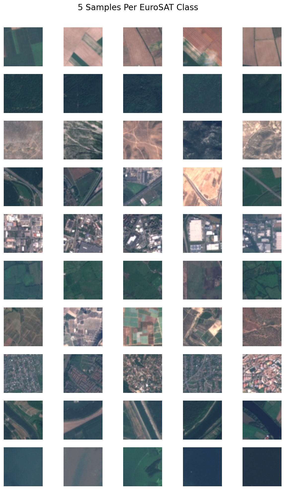

**Class distribution**

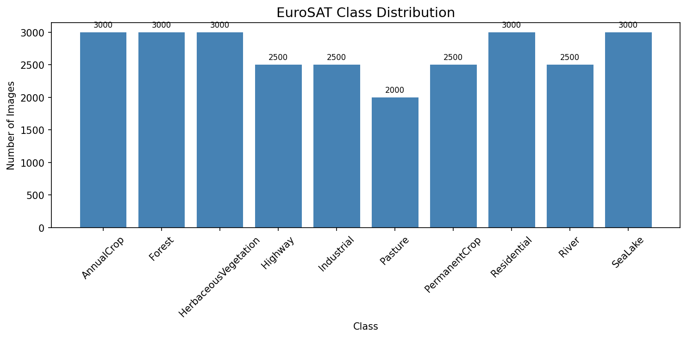

</div>

---

## 🧱 Baseline CNN

The baseline is a lightweight **SimpleCNN** trained from random weight initialisation, serving as the reproducible performance floor against which transfer learning gains are measured.

**Architecture:**
- 3× Conv-BN-ReLU-MaxPool blocks (32 → 64 → 128 channels)
- Global Average Pooling
- Dropout (0.5) + Linear classifier

**Training:** 1 epoch on EuroSAT training set, Adam optimiser, EarlyStopping on validation loss.

**Result:** The baseline achieved **60.6% accuracy** and **58.1% macro-F1** on the EuroSAT test set after one epoch — demonstrating that learning meaningful spectral and spatial features requires either more epochs or a pretrained backbone.

<details>
<summary>📋 Per-class F1 — Baseline CNN</summary>

| Class | Precision | Recall | F1 | Support |
|-------|-----------|--------|----|---------|
| AnnualCrop | 58.3% | 88.0% | 70.1% | 100 |
| Forest | 53.4% | 87.0% | 66.2% | 100 |
| HerbaceousVegetation | 50.9% | 54.0% | 52.4% | 100 |
| Highway | 44.4% | 16.0% | 23.5% | 100 |
| Industrial | 80.7% | 88.0% | 84.2% | 100 |
| Pasture | 53.9% | 70.0% | 60.9% | 100 |
| PermanentCrop | 56.3% | 40.0% | 46.8% | 100 |
| Residential | 68.6% | 81.0% | 74.3% | 100 |
| River | 56.9% | 29.0% | 38.4% | 100 |
| SeaLake | 81.5% | 53.0% | 64.2% | 100 |
| **Macro avg** | **60.5%** | **60.6%** | **58.1%** | **1,000** |

</details>

<div align="center">

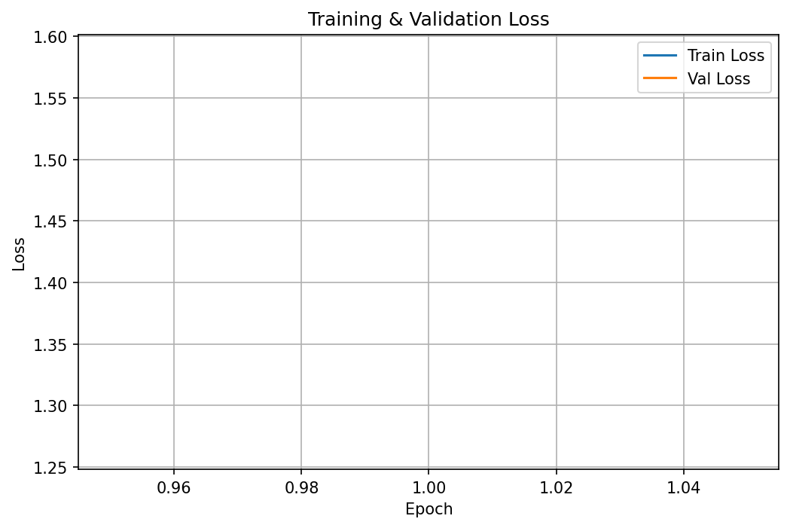
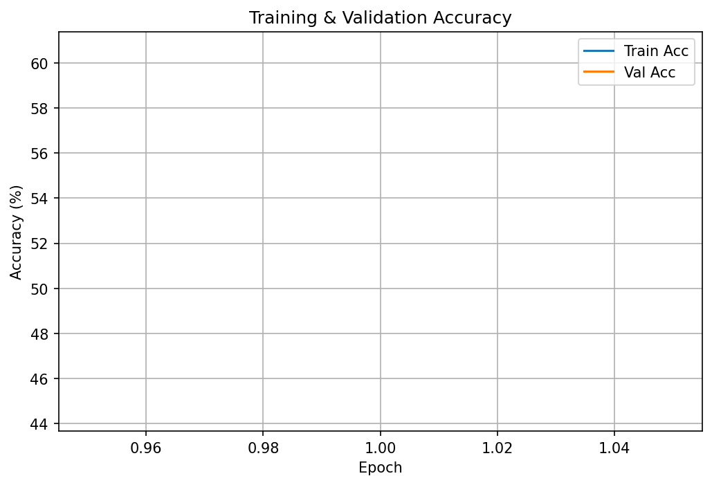
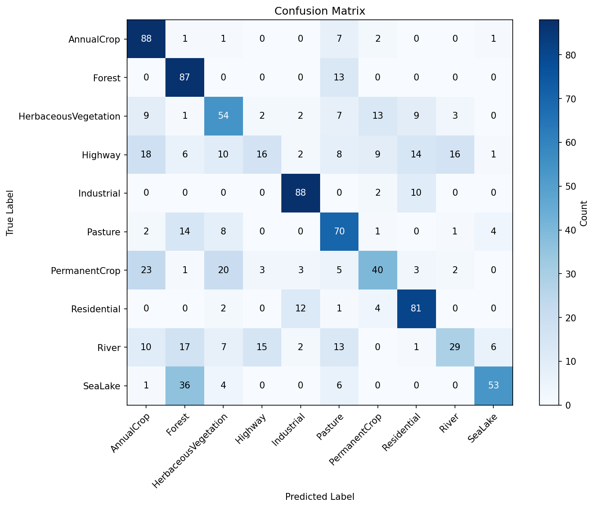

</div>

---

## 🔁 Transfer Learning

The transfer learning module uses **ResNet-18 pretrained on ImageNet** with a custom two-layer classifier head appended in place of the original FC layer.

### Architecture

```
ResNet-18 backbone (ImageNet weights)
    └── Custom Head:
          Linear(512 → 512) → ReLU → Dropout(0.3) → Linear(512 → 10)
```

### Two-Phase Training Strategy

| Phase | Layers Updated | Epochs | Learning Rate | Best Val Acc |
|-------|---------------|--------|--------------|--------------|
| **Phase 1 — Frozen backbone** | Classifier head only | 3 | `1e-3` | 89.03% |
| **Phase 2 — Selective unfreeze** | `layer3`, `layer4` + head | 5 | `1e-4` | 97.18% |

**Rationale:**
- **Freeze backbone:** Protects pretrained low-level feature detectors (edges, textures) from being overwritten by the small domain-specific dataset early in training.
- **Train classifier only:** Allows the new head to align with the existing feature space before any backbone weights move.
- **Unfreeze `layer3` + `layer4`:** The deeper blocks encode higher-level semantics; unlocking them lets the model adapt to satellite-specific patterns (spectral textures, land-cover geometry) that differ from natural photos.
- **Reduced LR (÷10):** Prevents catastrophic forgetting — small gradient steps nudge pretrained weights rather than overwriting them.
- **Adam + ReduceLROnPlateau:** Adapts per-parameter learning rates and backs off automatically when validation loss plateaus.

<details>
<summary>📈 Epoch-by-epoch training history</summary>

| Epoch | Phase | Train Loss | Train Acc | Val Loss | Val Acc |
|-------|-------|-----------|-----------|----------|---------|
| 1 | Frozen | 0.707 | 75.97% | 0.403 | 85.79% |
| 2 | Frozen | 0.496 | 82.55% | 0.368 | 87.28% |
| 3 | Frozen | 0.454 | 84.30% | 0.331 | 89.03% |
| 4 | Fine-tune | 0.287 | 90.42% | 0.132 | 95.62% |
| 5 | Fine-tune | 0.169 | 94.42% | 0.116 | 95.82% |
| 6 | Fine-tune | 0.138 | 95.42% | 0.116 | 96.51% |
| 7 | Fine-tune | 0.122 | 95.91% | 0.104 | 96.59% |
| 8 | Fine-tune | 0.107 | 96.43% | **0.091** | **97.18%** |

</details>

<div align="center">

**EuroSAT Confusion Matrix — Fine-tuned ResNet-18**

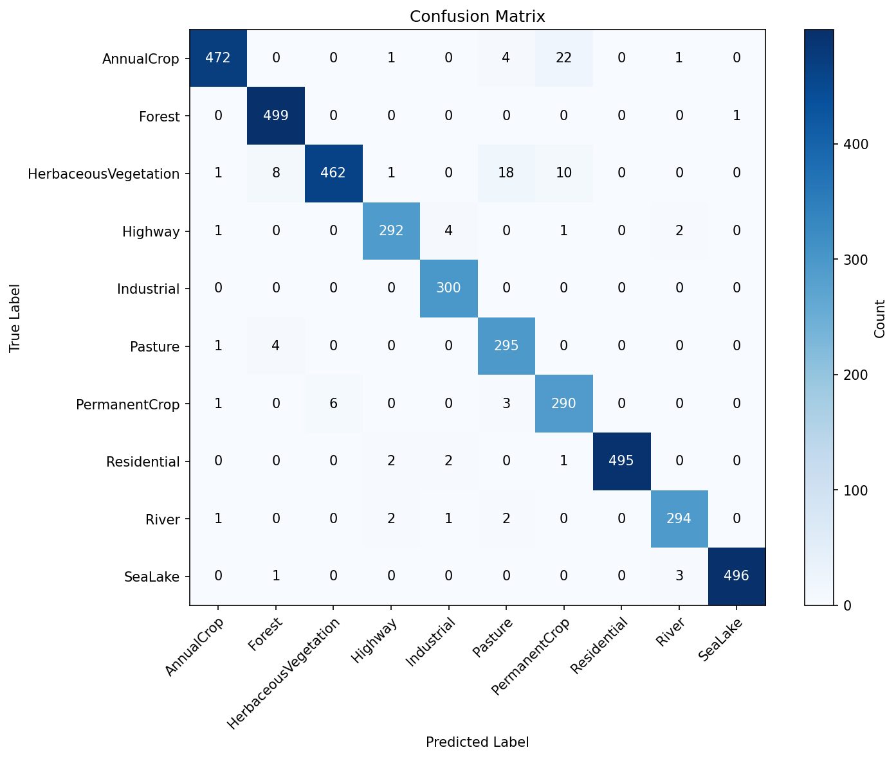

**UC Merced Confusion Matrix — Zero-shot cross-domain**

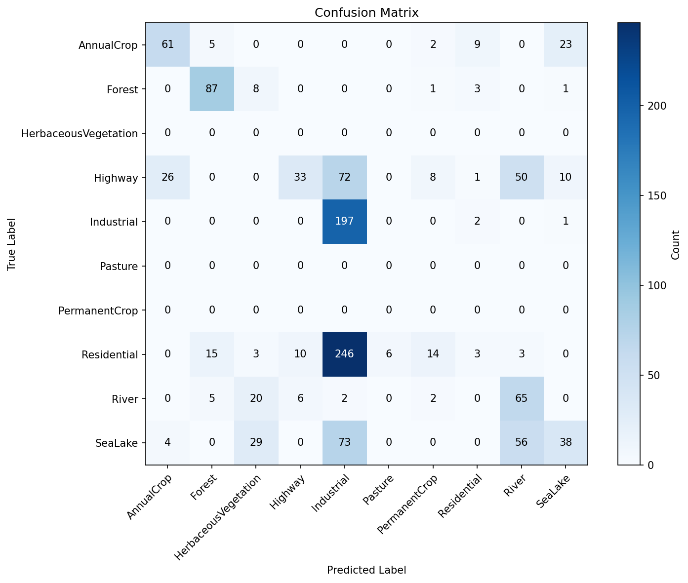

</div>

---

## 🕐 Temporal Change Detection

The change detector reuses the trained ResNet-18 backbone as a **frozen feature extractor**, stripping the classifier head to obtain **512-dimensional embedding vectors** for each satellite tile.

### Pipeline

```
Image (T1)  ──►  ResNet-18 backbone  ──►  embedding_t1  (512-d)
Image (T2)  ──►  ResNet-18 backbone  ──►  embedding_t2  (512-d)
                                              │
                        cosine_similarity(embedding_t1, embedding_t2)
                                              │
                            similarity < threshold  ──►  CHANGED
                            similarity ≥ threshold  ──►  UNCHANGED
```

### Threshold Selection — Youden's J Statistic

The optimal operating threshold is selected by maximising **Youden's J = Sensitivity + Specificity − 1** on the ROC curve, balancing the cost of missed changes against false alarms.

| Metric | Value |
|--------|-------|
| **ROC AUC** | **0.986** |
| **Selected Threshold** | **0.6204** |
| Optimal TPR (Sensitivity) | 94.1% |
| Optimal FPR (1 − Specificity) | 5.2% |

<div align="center">

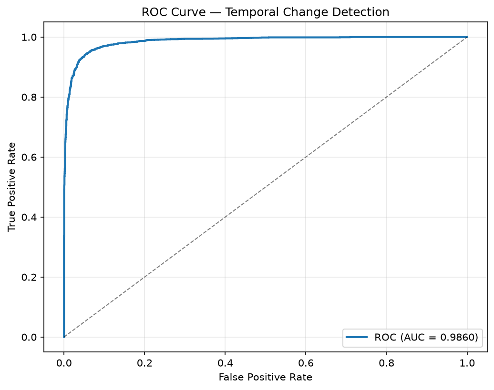

**Change detection heatmap — sample pair**

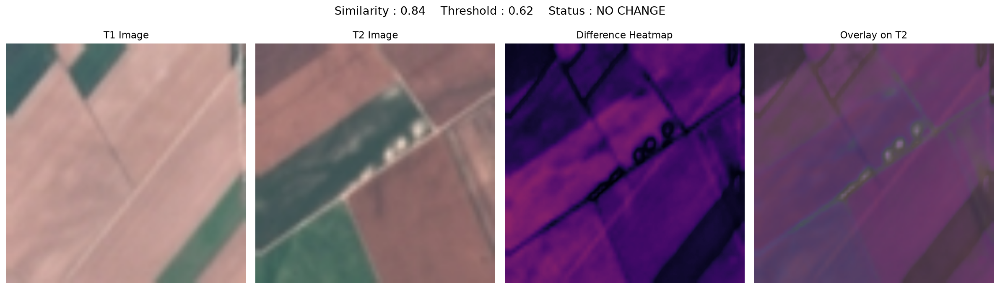

</div>

---

## 🧪 Spatial Leakage Experiment

### Motivation

Standard random stratified splitting shuffles *individual images* before partitioning. Because EuroSAT tiles are derived from contiguous Sentinel-2 raster scans, spatially adjacent patches share identical atmospheric conditions, illumination angles, and spectral calibration. A model can inadvertently memorise tile-level texture artefacts rather than learning general land-cover semantics — a phenomenon known as **spatial autocorrelation** or **geographic leakage**.

### Experimental Design

- **Random split:** Individual images shuffled uniformly before 70/15/15 split.
- **Spatial block split:** Consecutive images are grouped into blocks of 100; entire blocks are assigned to one partition only, preventing any geographic neighbourhood from straddling train and test sets.

Both splits use the same ResNet-18 fine-tuning protocol for a fair comparison.

### Results

| Metric | Random Split | Spatial Split | Gap |
|--------|:-----------:|:-------------:|:---:|
| **Accuracy** | 98.44% | 97.38% | **↓ 1.06 pp** |
| **Macro F1** | 98.39% | 97.20% | **↓ 1.19 pp** |
| **Macro Precision** | 98.37% | 96.98% | **↓ 1.39 pp** |
| **Macro Recall** | 98.44% | 97.51% | **↓ 0.93 pp** |
| Test samples | 4,050 | 4,000 | — |

### Interpretation

The **~1 pp accuracy gap** confirms that naive random splitting introduces a small but measurable over-optimism. The spatial-split accuracy (97.38%) is a more honest estimate of real-world generalisation to unseen geographic regions. Crucially, the ResNet-18 backbone still delivers strong performance under spatial blocking — indicating that ImageNet-pretrained features are genuinely transferable to satellite imagery, not merely memorising scene-level artefacts.

<div align="center">

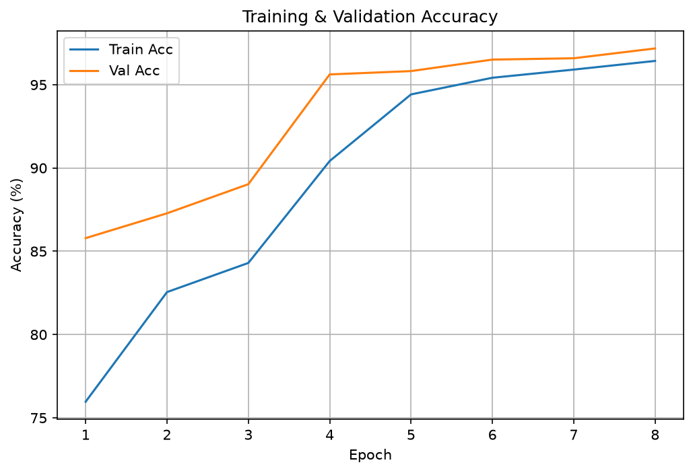
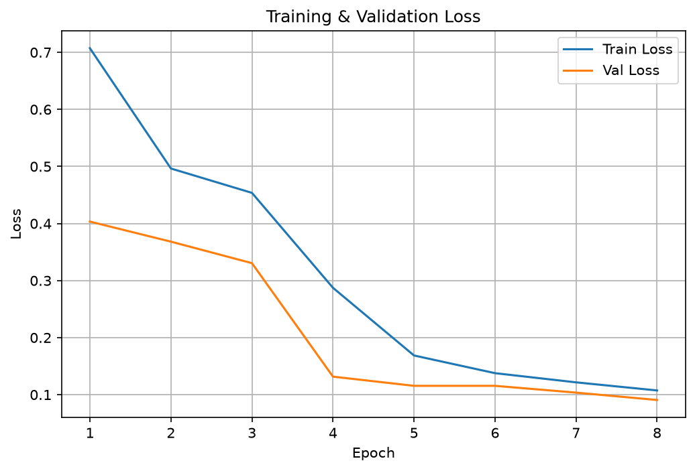

</div>

---

## 🔎 Error Analysis

The fine-tuned ResNet-18 was analysed for its **top-5 most confidently misclassified** images — cases where the model assigned high softmax probability to the wrong class.

<div align="center">

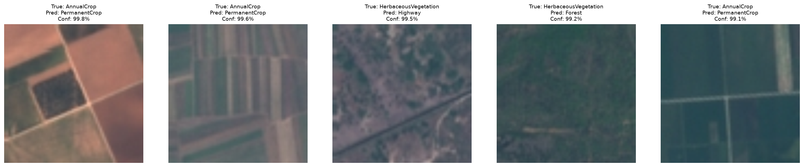

</div>

| # | True Label | Predicted Label | Confidence | Hypothesis |
|---|-----------|----------------|:----------:|------------|
| 1 | AnnualCrop | PermanentCrop | 99.8% | Annual crops at peak vegetation season mimic the spectral and structural signature of permanent plantations |
| 2 | AnnualCrop | PermanentCrop | 99.6% | Same as above — row-crop geometry overlaps with orchard geometry at 64×64 resolution |
| 3 | HerbaceousVegetation | Highway | 99.5% | Linear spectral features in sparse herbaceous cover can resemble road infrastructure |
| 4 | HerbaceousVegetation | Forest | 99.2% | Tall, dense herbaceous cover mimics forest texture when individual tree canopies are not distinguishable |
| 5 | AnnualCrop | PermanentCrop | 99.1% | Recurring AnnualCrop → PermanentCrop confusion is the model's primary failure mode |

**Key finding:** The dominant confusion is **AnnualCrop ↔ PermanentCrop**, suggesting that higher-resolution imagery, multi-temporal inputs, or NDVI-band inclusion would be the most impactful next improvements.

---

## 🖥️ Geo-Dashboard

An interactive **Streamlit dashboard** provides a fully local, no-internet inference interface integrating all three project modules.

### Capabilities

- Upload **two satellite tile images** (before and after time points)
- Display **predicted land-use class + confidence score** for each tile
- Compute and display **cosine similarity** between their 512-d embeddings
- Render a **side-by-side change heatmap** and emit a binary **CHANGED / UNCHANGED** flag

> The dashboard runs entirely offline after setup — no API calls or cloud dependencies.

<div align="center">

> 📸 *Dashboard screenshot — add after recording a demo session*
>
> `assets/dashboard.png` ← replace this placeholder once captured

</div>

---

## 🚀 Installation

### Option A — pip (virtualenv)

```bash
# Clone the repository
git clone https://github.com/<your-username>/satellite-landuse.git
cd satellite-landuse

# Create and activate a virtual environment
python -m venv .venv
# Windows
.venv\Scripts\Activate.ps1
# macOS / Linux
source .venv/bin/activate

# Install dependencies
pip install --upgrade pip
pip install -r requirements.txt
```

### Option B — Conda

```bash
conda env create -f environment.yml
conda activate satellite-landuse
```

### Data Setup

```
data/
├── raw/
│   ├── EuroSAT/2750/           ← 10 class sub-folders (AnnualCrop/, Forest/, …)
│   └── UC Merced/UCMerced_LandUse/Images/   ← 21 class sub-folders
```

---

## ▶️ How to Run

### 1. Train the baseline CNN

```bash
python train_baseline.py
```

Outputs: `models/baseline_best.pt`, `reports/loss_curve.png`, `reports/accuracy_curve.png`, `reports/confusion_matrix.png`

### 2. Two-phase transfer learning

```bash
python train_transfer.py
```

Outputs: `models/phase1_best.pt`, `models/phase2_best.pt`, `models/phase2_final.pt`, training curves, confusion matrices

### 3. Temporal change detection

```bash
python run_change_detection.py
```

Outputs: `embeddings/embeddings.npz`, `reports/change_roc_curve.png`, `reports/change_threshold.json`, `reports/change_heatmaps/`

### 4. Spatial leakage experiment

```bash
python -m src.spatial_split
```

Outputs: `reports/spatial_leakage_results.csv`, `reports/spatial_leakage.md`

### 5. Launch the Streamlit dashboard

```bash
streamlit run app/streamlit_app.py
```

Opens at `http://localhost:8501` — no internet connection required after setup.

---

## 📊 Results Summary

| Module | Metric | Value |
|--------|--------|:-----:|
| **Baseline CNN** | Test Accuracy | 60.6% |
| **Baseline CNN** | Macro F1 | 58.1% |
| **Baseline CNN** | Parameters | 374K |
| **Transfer — Phase 1 (Frozen)** | Val Accuracy | 89.0% |
| **Transfer — Phase 1 (Frozen)** | Test Accuracy | 87.7% |
| **Transfer — Final (Fine-tuned)** | Val Accuracy | 97.2% |
| **Transfer — Final (Fine-tuned)** | Test Accuracy | **97.4%** |
| **Transfer — Final (Fine-tuned)** | Macro F1 | **97.2%** |
| **Transfer — Final (Fine-tuned)** | Parameters | 10.76M |
| **Transfer — UC Merced (zero-shot)** | Accuracy | 40.3% |
| **Change Detection** | ROC AUC | **0.986** |
| **Change Detection** | Youden Threshold | 0.6204 |
| **Change Detection** | TPR at threshold | 94.1% |
| **Spatial Leakage Gap** | Accuracy drop (random → spatial) | 1.06 pp |
| **Spatial Leakage Gap** | Macro F1 drop | 1.19 pp |

---

## 🎬 Demo Video

A walkthrough video demonstrating the full project — baseline training, transfer learning, change detection, and the Streamlit dashboard — is available at the link below.

**Google Drive Link**

> 🔗 [`PASTE_VIDEO_LINK_HERE`](PASTE_VIDEO_LINK_HERE)

---

## 🔭 Future Improvements

| Improvement | Impact |
|------------|--------|
| **GradCAM / GradCAM++** | Visualise which image regions drive class decisions; improves model interpretability |
| **UMAP / t-SNE embeddings** | Richer non-linear visualisation of the embedding manifold vs. linear PCA |
| **Threshold presets** | Pre-configured sensitivity / specificity trade-offs for common operational scenarios (e.g., deforestation monitoring, urban expansion) |
| **Model optimisation** | ONNX export, TorchScript, int8 quantisation for edge deployment |
| **Multi-temporal training** | Incorporate labelled before/after image pairs for supervised change detection |
| **Additional spectral bands** | Use all 13 Sentinel-2 bands instead of RGB-only for improved discrimination |
| **EfficientNet-B0 comparison** | Benchmark against EfficientNet-B0 as an alternative lightweight backbone |

---

## 🙏 Acknowledgements

- **[EuroSAT](https://github.com/phelber/EuroSAT)** — Helber, P., Bischke, B., Dengel, A., & Borth, D. (2019). EuroSAT: A Novel Dataset and Deep Learning Benchmark for Land Use and Land Cover Classification. *IEEE Journal of Selected Topics in Applied Earth Observations and Remote Sensing*.
- **[UC Merced Land Use Dataset](http://weegee.vision.ucmerced.edu/datasets/landuse.html)** — Yang, Y., & Newsam, S. (2010). Bag-of-Visual-Words and Spatial Extensions for Land-Use Classification. *ACM SIGSPATIAL GIS*.
- **[PyTorch](https://pytorch.org/)** — The deep learning framework powering all model training, transfer learning, and inference.
- **[Streamlit](https://streamlit.io/)** — The framework used to build the interactive Geo-Dashboard with zero front-end code.
- **[TorchVision](https://pytorch.org/vision/)** — Pretrained ResNet-18 weights and image transform utilities.

---

<div align="center">

**Built by Vikas Yadav · Celebal Technologies CEI Internship 2026**

</div>
